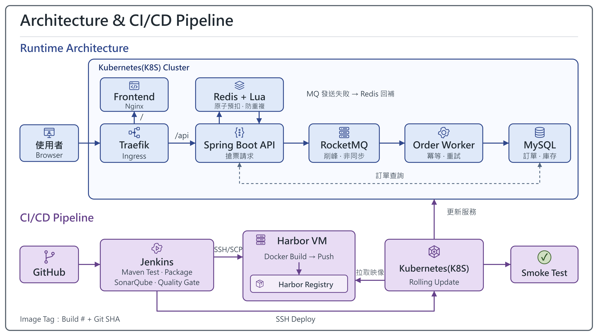

# Ticket System

模擬熱門活動開賣時多人同時搶票，提供活動瀏覽、搶票與訂單查詢，並整合 Kubernetes 部署與 Jenkins CI/CD。

## 實作重點

- Redis Lua：原子庫存預扣、資格檢查與防重複購買。
- RocketMQ + Order Worker：非同步下單，透過 MySQL 交易與冪等處理更新訂單及庫存。
- 異常處理：MQ 發送失敗時回補 Redis，前端確認訂單成立後才顯示成功。
- CI/CD：Jenkins 執行測試與品質檢查，在 Harbor VM 遠端建置、推送映像，再進行 Kubernetes 滾動更新與 Smoke Test。

## 技術

Java 21 / Spring Boot / MySQL / Redis / RocketMQ / Docker / Kubernetes / Traefik / Jenkins / SonarQube / Harbor

## 開發者工具

右上角可預覽指令並確認執行：庫存/訂單查詢、多人搶票、重複購買測試及單一活動重設。多人測試上限 500 次、同時 10 次；取得資格與實際成立訂單分開統計。

沒有登入或權限系統，僅供私人環境。預設 `DEVELOPER_TOOLS_ENABLED=false`，先更新全部 Backend、Order Worker 與 Frontend，再啟用 Backend 的此環境變數。重設僅支援 `REDIS_LUA_MQ`，會刪除所選活動的所有訂單，操作前須明確確認。

重設直接呼叫 API，不新增資料表或保存確認單。請等搶票請求與訂單處理完成再重設；不支援邊搶票邊重設，也不會清空 MQ。重設失敗時活動保持關閉。

## 專案結構

- `backend/`：API 與搶票邏輯
- `frontend/`：活動頁面與訂單介面
- `order-worker/`：訂單訊息消費與資料庫寫入
- `k8s/part7/`：Kubernetes 設定
- `Jenkinsfile`、`ci/part8/`：CI/CD 流程
- `scripts/`：測試、前端預覽與維運腳本
